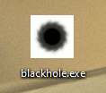
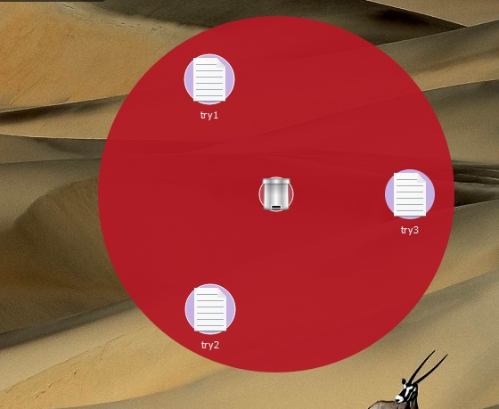

<h2 align="center">Uygulama Görselleri</h2>

<table align="center">
  <tr>
    <td align="center">
      <strong>Uygulama İkonu</strong> 
      
    </td>
    <td align="center">
      <strong>Çoklu Çağırma</strong> 
      
    </td>
  </tr>
  <tr>
    <td align="center">
      <strong>Çoklu Gönderme</strong> 
      
    </td>
    <td align="center">
      <strong>Mod Değiştirme</strong> 
      
    </td>
  </tr>
  <tr>
    <td align="center">
      <strong>Çoklu Silme</strong> 
      
    </td>
    <td align="center">
      </td>
  </tr>
</table>
